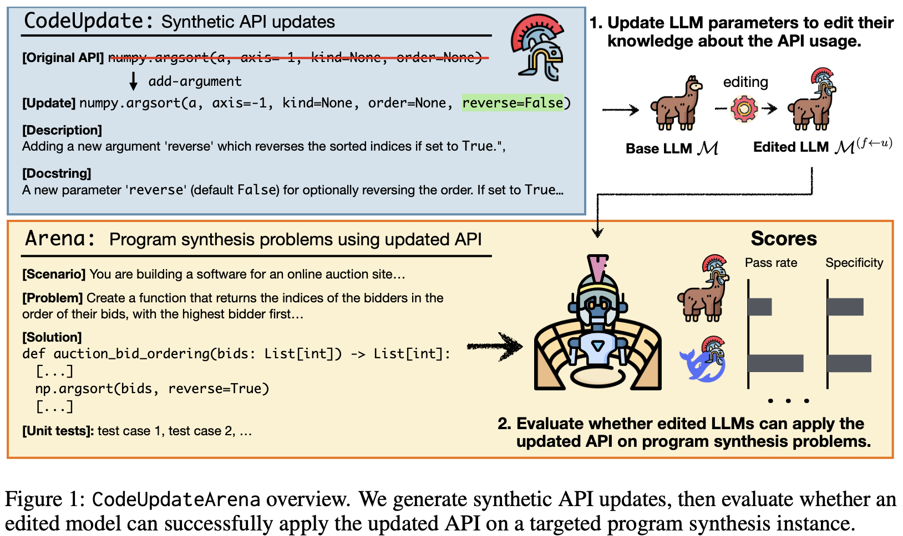
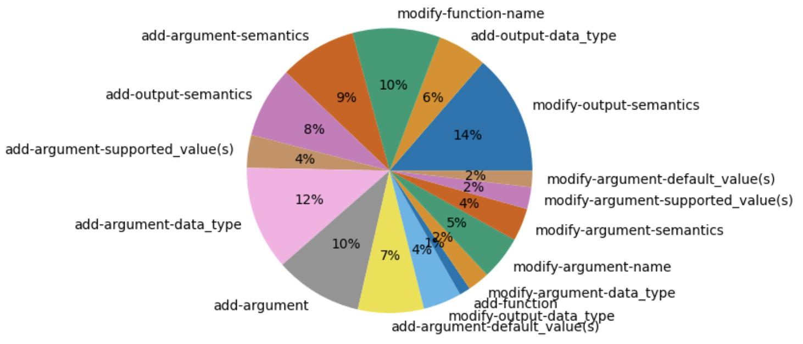
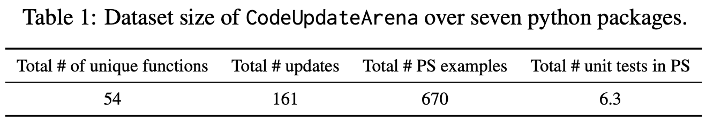
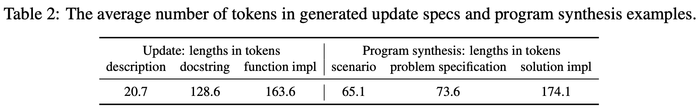
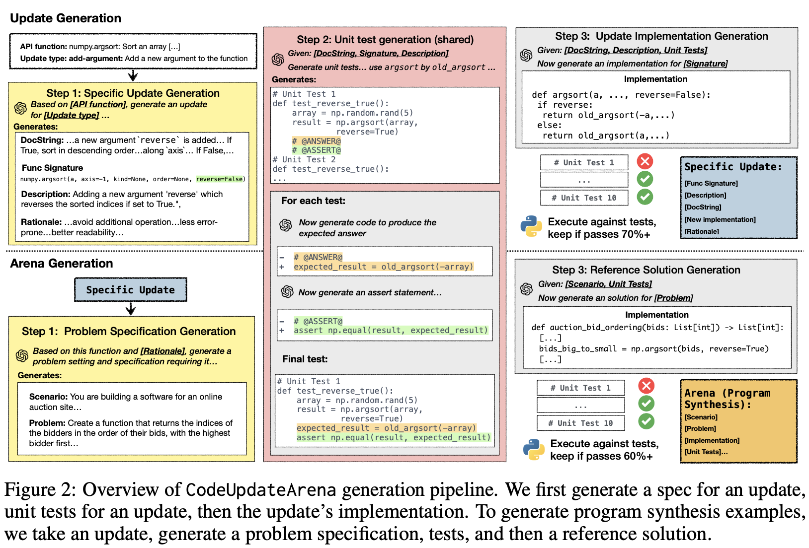

# `CodeUpdateArena`: Benchmarking Knowledge Editing on API Updates

**Authors**: Zeyu Leo Liu, Shrey Pandit, Xi Ye, Eunsol Choi, Greg Durrett

Please check out our work [TBD] 📃

<picture>

</picture>
<br/>

## Reproducing knowledge editing baselines

We provide bash scripts to run experiment in [scripts](https://github.com/leo-liuzy/CodeUpdateArena/tree/main/scripts) directory. 

The prompts of our experiments could be mainly divided into three parts:
* `[Update]`: information about the update --- updated function signature, docstring about the update, etc.
* `[Task]`: task format using an example datum.
* `[Test]`: the intended test input

For all of our run scripts, we assume you already set environment variable `MODEL_PATH` to the path of model checkpoint or huggingface id, and `GPU_IDS` (essentially `CUDA_VISIBLE_DEVICES`).

### Prepending
This experiment corresponds to giving input of the format: `[Update]+[Task]+[Test]` to (any) code generation models. Note, this baseline does not update the model parameters, but learns about the update purely **in-context**.

Simply running the following code will start your first experiment with GPT-4 (Be sure to set your environment variable `OPENAI_API_KEY`)

```bash
bash scripts/prepend.sh 
```
Running this script will prompt model to predict solutions (`usage=eval`); and then, execute the predicted solutions (`usage=exec`).

To run the experiment without `[Update]` (i.e. `[Task]+[Test]`), we prepare another script:
```bash
bash scripts/base.sh 
```

To run the code on other model, please set `model.model_name_or_path` to the path to your model directory or some huggingface model id.

### FT (U) [FT=Finetuning]

**Train**: next-token prediction objective on `[Update]`. 

**Test**: input of format `[Task]+[Test]`. 

In our paper, we also include an ablation study that tests on `[Update]+[Task]+[Test]`. To conduct the experiment for both, run:

```bash
bash scripts/ft_u.sh
```

**P.S.** All our FT experiment is finetuning with LoRA.


### FT (PS)
**Train**: SFT, where the context is `[Task]+[Test]` and the response is reference solution.

**Test**: `[Task]+[Test]`.

To conduct the experiment for both, run:
```bash
bash scripts/ft_ps.sh
```


### FT (U+PS)
This is very similar to FT(PS), but with the update docstring prepended in-context.

**Train**: SFT, where the context is `[Update]+[Task]+[Test]` and the response is reference solution.

**Test**: `[Task]+[Test]`.

In our paper, we also include an ablation study that tests on `[Update]+[Task]+[Test]`. To conduct the experiment for both, run:
```bash
bash scripts/ft_ups.sh
```

### Specificity
As a desiderata of model editing, we don't want the model to overfit on the intended `[Update]` and crush the model's other capability. We test so by measuring the difference in model's performance on a (fixed) sample of `HumanEval`.


To do so, one only needs to take the run script of any FT experiment, and set `usage=specificity`. We show an example with FT(U) in script:
```bash
bash scripts/specificity.sh
```


### Random-FT
In the paper, we have an ablation study to understand what the model is actually learning via the fine-tuning process. We fine-tune on program synthesis examples from other random updates.

Like experiment for [specificity](#specificity), one only needs to take the run script of any FT experiment and set `usage=rand_eval` (also, correspondingly, `usage=rand_exec`). We show some examples in the script:
```bash
bash scripts/rand_ft.sh
```


## Description

The goal of our benchmark is to update an LLM about code API update and be able to solve "related" program synthesis example *without providing documentation of the update at inference time*.

Our `CodeUpdateArena` benchmark contains **fictitious** and **executable** updates to 54 functions from 7 diverse Python packages. 

An instance in our benchmark consists of a synthetic API function update paired with a program synthesis example that is biased to use the updated functionality. Each fictitious update is paired with at least 3 (executable) program synthesis examples. 


### Benchmark Access

```python
from datasets import load_dataset

ds = load_dataset("leo-liuzy/CodeUpdateArena")
```

The *goal* of our benchmark is to update an LLM to be able to solve this program synthesis example *without providing documentation of the update at inference time*. Our Benchmark is available on HuggingFace 🤗 More benchmark details can be found [here](https://huggingface.co/datasets/leo-liuzy/CodeUpdateArena).


### Dataset statistics
<picture>
<p align="center">
  
</p>
</picture>

<picture>

</picture>

<br/>

<picture>

</picture>

<br/>

<picture>

</picture>

<br/>


## Synthetic Data Generation

<picture>

</picture>

**Check out the details in our paper!**

We provide code for dataset generation in [src/data](https://github.com/leo-liuzy/CodeUpdateArena/tree/main/src/data) directory. The core scripts are `manager_update.py` and `manager_prog_syn.py`, which are pipelines to generate updates and program synthesis examples separately. Both scripts follow similar generation procedures but use different sets of prompts.

We also include the core code to automatically de-duplicate generated program synthesis examples. See `auto-dedup.py` in the `scripts` directory.

## Citation

If you found our work useful, please consider citing our work.
```
TBD
```