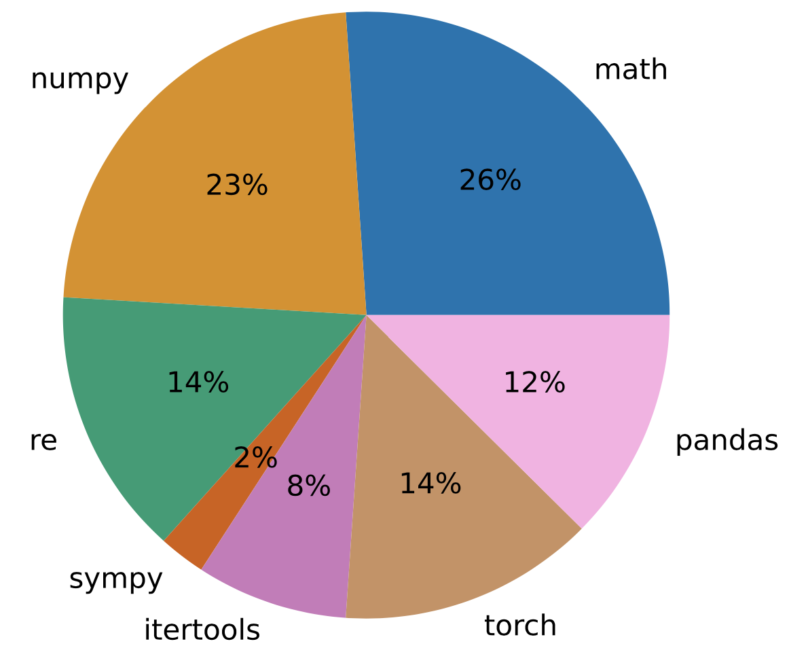

# `CodeUpdateArena`: Benchmarking Knowledge Editing on API Updates

Authors: Zeyu Leo Liu, Shrey Pandit, Xi Ye, Eunsol Choi, Greg Durrett

Please check out our work [TBD] 📃


## Description

The goal of our benchmark is to update an LLM about code API update and be able to solve "related" program synthesis example *without providing documentation of the update at inference time*.

`CodeUpdateArena` benchmark contains **fictitious** and **executable** updates to 54 functions from 7 diverse Python packages. 

An instance in our benchmark consists of a synthetic API function update paired with a program synthesis example that is biased to use the updated functionality. Each fictitious update is paired with at least 3 (executable) program synthesis examples. 


### Benchmark Access

```python
from datasets import load_dataset

ds = load_dataset("leo-liuzy/CodeUpdateArena")
```

The *goal* of our benchmark is to update an LLM to be able to solve this program synthesis example *without providing documentation of the update at inference time*.Our Benchmark is available on HuggingFace 🤗 More benchmark details can be found [here](https://huggingface.co/datasets/leo-liuzy/CodeUpdateArena).


### Dataset statistics
<p align="center">
  
</p>


<br/>


<br/>


<br/>


## Synthetic Data Generation


**Check out the details in our paper!**

We provide code for dataset generation in [src/data](https://github.com/leo-liuzy/CodeUpdateArena/tree/main/src/data) directory. The core scripts are `manager_update.py` and `manager_prog_syn.py`, which are pipelines to generate update and program synthesis respectively. Both script follows similar generation procedure but uses different sets of prompts.

We also include the core code to automatically de-duplicate generated program synthesis examples. See `auto-dedup.py` in `scripts` directory.

## Reproducing knowledge editing baselines

We provide bash script to run experiment in [script](https://github.com/leo-liuzy/CodeUpdateArena/tree/main/scripts) directory. We **highly recommend** running code to predict solution (e.g. `usage=eval`) and (e.g. `usage=exec`) separately. In each script, we left comments on how to use it.

## Citation

If you found our work useful, please consider citing our work.
```
TBD
```